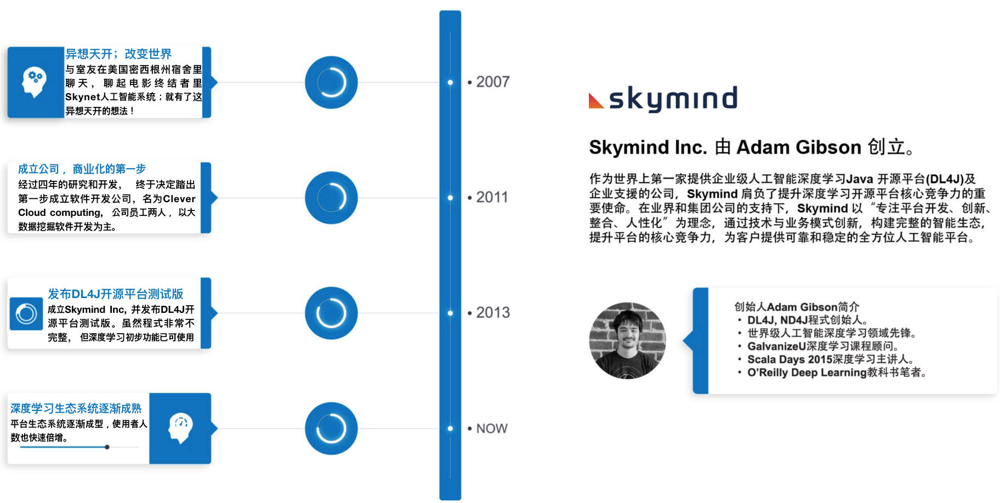
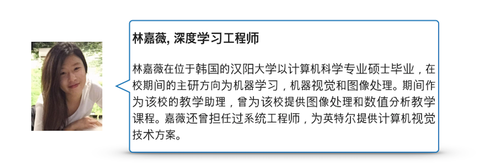
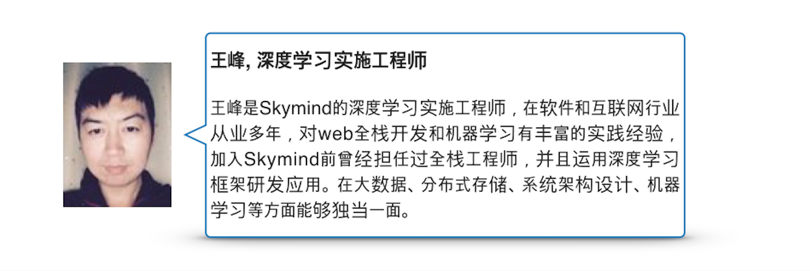
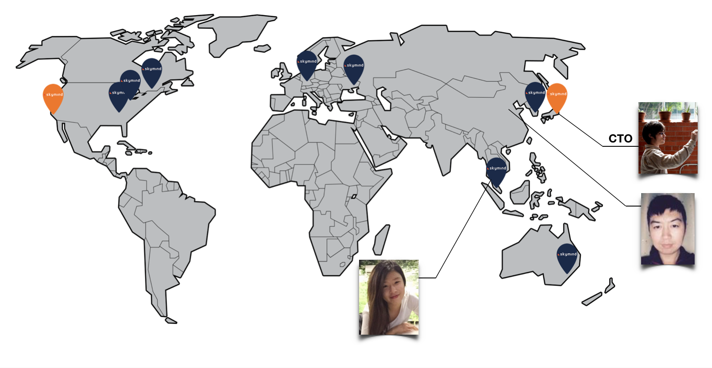
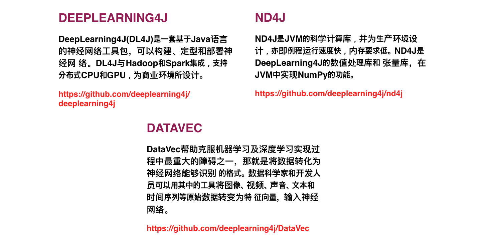
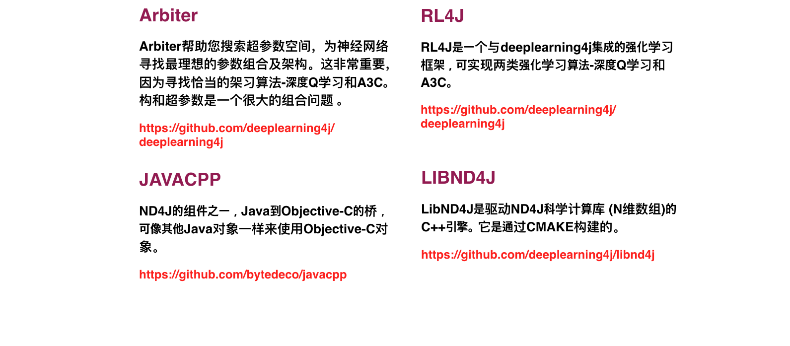
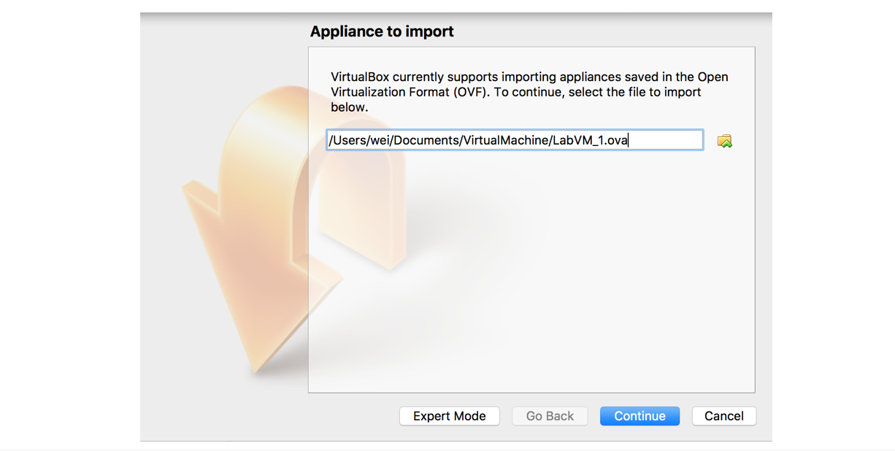

!SLIDE

# 欢迎来到2天的实践课程

* 深度学习理论和实践

!SLIDE

# 时程表

* 9:00 AM 开始
* 10:30 AM -> 11:00 AM 上午茶歇
* 12:00 AM -> 1:30 PM 午餐
* 3:00 PM -> 3:30 PM 下午茶歇
* 每 50 分钟休息 10 分钟

!SLIDE

# 培训内容（第一天）

* 思凯迈介绍
* 机器学习回顾
* 神经网络，深度网络基础
* Deeplearning4j架构介绍
* 前馈神经网络
* DeepLearning4J Training UI-训练用户界面概述
* [实验]简单神经网络
* 调优
* [实验]DataVec
* 循环神经网络介绍
* [实验]用LSTM预测序列数据
* [实验]用LSTM实现天气预报

!SLIDE

# 培训内容（第二天）
* [实验]用LSTM实现序列分类
* [实验]Physionet多变量时间序列分类
* 保存和加载模型
* [实验]模型保存与加载
* 卷积神经网络
* YOLO理论知识
* Skil-ce简介
* YOLO SKIL
* 通往生产之路
* 保存Keras模型
* 把Keras模型往DL4J加载

!SLIDE

# 实验内容

* 使用 Intellij 进行 Java 实习
* 实习教材
  * 简单网络实验
  * DataVec实验
  * 用LSTM预测序数据
  * 用LSTM实现天气预报
  * 用LSTM实现序列分类
  * Physionet多变量时间序列分类实验
  * 模型保存与加载实验

!SLIDE

# 介绍大纲

* 思凯迈介绍
* 讲师介绍
* 参与者介绍
* 开源库系列
* 深度学习教科书
* 虚拟器安装

!SLIDE

# 思凯迈介绍

!SLIDE

# 讲师介绍

!SLIDE

# 讲师介绍

!SLIDE

# 我们的工程师分布在全球各地

!SLIDE

# 参与者自我介绍

* 参加培训的目的？
* 有兴趣哪个主题? 关心领域？
* 本人的背景?

!SLIDE

# 开源库系列

* 核心组件是我们的整个开源库系列
* Deeplearning4j、ND4J、RL4J、DataVec、 Arbiter、JavaCPP和LibND4J等，涵盖了构建深度学习应用所需的全部要素

!SLIDE

# 开源库系列

* 核心组件是我们的整个开源库系列
* Deeplearning4j、ND4J、RL4J、DataVec、 Arbiter、JavaCPP和LibND4J等，涵盖了构建深度学习应用所需的全部要素

!SLIDE

# 虚拟器安装（实习用途）

* VMware或Virtualbox
* https://www.virtualbox.org/wiki/Downloads

!SLIDE

# 导入操作系统映像

* dl4j-training, intellij, java, maven, skil(optional)
* https://github.com/chiaweil/dl4j-training.git

!SLIDE

# 准备实习环境
