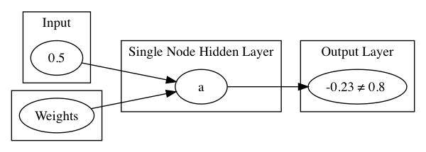
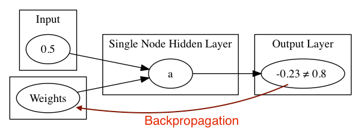

!SLIDE center subsection

# 神经网络示范

本章节使用最简单的例子介绍神经网络

!SLIDE

# 神经网络例子

* 神经网络例子细节
* 神经网络例子实验
* 关键的网络设定

!SLIDE

# 神经网络例子

## 目标: 输入值=0.5 输出值=0.8

!SLIDE

# 设置:
* 应用随机权重与神经元个别的激活函数 => 输出值

* 测验结果: -0.23 == 0.8 ?

!SLIDE

# 计算误差

* 使用反向传播调权重项
* 重复以上步骤

!SLIDE

# 简单网络-SimplestNetwork

* 请亲自取消代码注释和运行代码

!SLIDE

# 简单网络的设置

简单网络拥有值得注意的设置，因为它们将出现在所有神经网络中

* 学习速率
* 优化方法 (updater)
* 输出层激活函数
* 隐藏层激活函数
* 循环週期次数
* 误失函数

!SLIDE

# 从简单网络做推断

* 简单网络使用一个输入值和一个输出值，训练网络来预测正确的输出值
* 一般的神经网络会经过同样的过程与拥有更复杂的数据
* 输入数据可以是图像，文本，语音记录等等
* 输出数据可以是 T/F, 连续值, 标签
