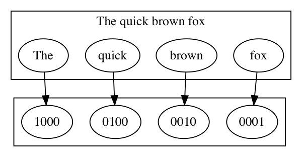
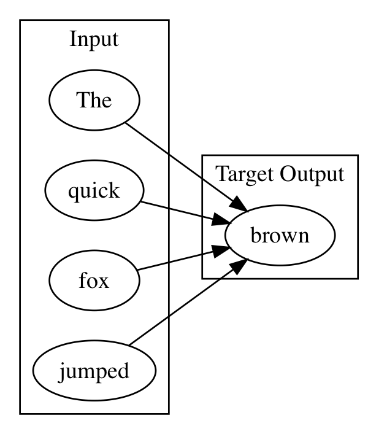
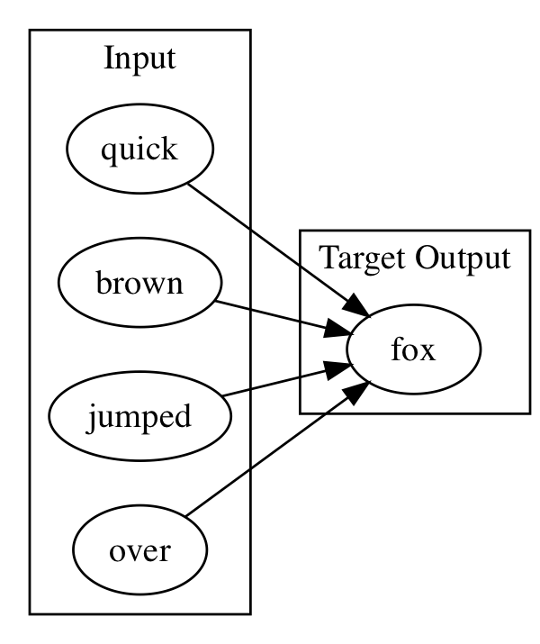

# Data Ingestion Case Study: Text


# Table of Contents


* PreProcessing and tokenization
* Bag of Words
* N-Grams
* Word2Vec
* Paragraph Vectors
* GloVE
* Words as Sequence of Characters


<div style="page-break-after: always;"></div>
----------------------
# Table of Contents

* **&rArr;** PreProcessing and tokenization
* Bag of Words
* N-Grams
* Word2Vec
* Paragraph Vectors
* GloVE
* Words as Sequence of Characters


-------------------
<div style="page-break-after: always;"></div>

# PreProcessing and Tokenization

* Tokenizer
	* Splits stream of words into individual words
	  * DefaultTokenizer
	  * NGramTokenizer 
  	  * PosUimaTokenizer
	  * UimaTokenizer
* PreProcessors
  * LowCasePreProcessor
  * StemmingPreprocessor
	  
  
-------------------
<div style="page-break-after: always;"></div>

* PreProcessing and tokenization
* **&rArr;** Bag of Words
* N-Grams
* Word2Vec
* Paragraph Vectors
* GloVE
* Words as Sequence of Characters


-------------------
<div style="page-break-after: always;"></div>

# Bag of Words 

Corpus is represented as the bag(multiset) of its words. 

* No Grammar
* No order
* Frequency only

"Bob and Carol and Ted and Alice"

Becomes the List
["Bob","and","Carol","Ted","Alice"]

Term frequency
 [1,3,1,1,1]
 
 


-------------------
<div style="page-break-after: always;"></div>

# Bag of Words Uses

* TfIDF
  * Frequency of word/document compared to word/corpus of documents


-------------------
<div style="page-break-after: always;"></div>

# Bag of Words Example 

* Lab folder has example
* Tokenizer to read files from directory and label with filename

```
TokenizerFactory tokenizerFactory = new DefaultTokenizerFactory();

        LabelAwareIterator iterator = new FilenamesLabelAwareIterator.Builder()
                .addSourceFolder(new ClassPathResource("bow").getFile())
                .useAbsolutePathAsLabel(false)
                .build();
```				


-------------------
<div style="page-break-after: always;"></div>

# Bag of Words Example .....

* Code to show contents of iterator

```
while(iterator.hasNext()){
            LabelledDocument doc = iterator.nextDocument();
            System.out.println(doc.getContent());
            System.out.println(doc.getLabels().get(0));
        }

        iterator.reset();

```


-------------------
<div style="page-break-after: always;"></div>

# Bag of Words Example .....


```
BagOfWordsVectorizer vectorizer = new BagOfWordsVectorizer.Builder()
                .setMinWordFrequency(1)
                .setStopWords(new ArrayList<String>())
                .setTokenizerFactory(tokenizerFactory)
                .setIterator(iterator)
                .build();
vectorizer.fit();
```				


-------------------
<div style="page-break-after: always;"></div>

# Bag of Words Example .....

* Code to explore the contents of the Bag of Words

```
	log.info(vectorizer.getVocabCache().tokens().toString());
    System.out.println(vectorizer.getVocabCache().totalNumberOfDocs());
    System.out.println(vectorizer.getVocabCache().docAppearedIn("two."));
    System.out.println(vectorizer.getVocabCache().docAppearedIn("one."));
    System.out.println(vectorizer.getVocabCache().docAppearedIn("world"));
```


-------------------
<div style="page-break-after: always;"></div>

* PreProcessing and tokenization
* Bag of Words
* **&rArr;** N-Grams
* Word2Vec
* Paragraph Vectors
* GloVE
* Words as Sequence of Characters

-------------------
<div style="page-break-after: always;"></div>

# NGrams 

* Contiguous sequence of n items from a sequence of text
* Example text ***"It is the year 2016"***
  * Extracted Bi-grams 
	* "It is" 
	* "is the" 
	* "the year" 
	* "year 2016"
  * Extracted Tri-grams 
	* "It is the" 
	* "is the year" 
	* "the year 2016"

-------------------
<div style="page-break-after: always;"></div>

# NGram uses

* Provide more context than Bag of Words
* Used in some neural networks for speech recognition to narrow the scope of prediction
  * RNN predicts next word out of top x percent of trigram for previous 2 word predictions
  

-------------------
<div style="page-break-after: always;"></div>

# Code Example: NGrams in DL4J

```

public static void main(String[] args) throws Exception{
        String toTokenize = "To boldly go where no one has gone before.";
        TokenizerFactory factory = new NGramTokenizerFactory(new DefaultTokenizerFactory(), 1, 2);
        Tokenizer tokenizer = factory.create(toTokenize);
        factory = new NGramTokenizerFactory(new DefaultTokenizerFactory(), 2, 3);
        List<String> tokens = factory.create(toTokenize).getTokens();
        log.info(tokens.toString());
```

Output

```
[To, boldly],  [boldly, go],  [go, where],......
[To, boldly, go],  [boldly, go, where] ......

```


-------------------
<div style="page-break-after: always;"></div>

* PreProcessing and tokenization
* Bag of Words
* N-Grams
* **&rArr;** Word2Vec
* Paragraph Vectors
* GloVE
* Words as Sequence of Characters

-------------------
<div style="page-break-after: always;"></div>


# Word2Vec

* Model for word embeddings
* Vector Space 
* Each word in corpus => vector in multi-dimensional vector space
* Relative location of word in vector space denotes relationship
	* Distance and direction from Boy->Man
	* Distance and Direction from Girl->Woman

-------------------
<div style="page-break-after: always;"></div>


# Word2Vec

* Model for word embeddings
* Vector Space 
* Each word in Corpus => Vector in Vector Space

-------------------
<div style="page-break-after: always;"></div>

# Word2Vec - Generating the Vector Space

* Neural Network trained to return word probabilities of a moving window
	* Given word "Paris", out of the corpus of words predict probility of each word occuring within say five words of the word "Paris"
* One hot Vector, size of every word in the corpus
* all 0's except for 1 representing the word
* See Demo https://ronxin.github.io/wevi/
* See example in intellij
* Allows you to do word math
	* King - Man + Woman = (?) Queen
	


-------------------
<div style="page-break-after: always;"></div>

# One-hot encoding

* Vector, the size of the vocabulary, all 0 except for single 1



-------------------
<div style="page-break-after: always;"></div>

# Two Methods for Building word2vec

* CBOW
  * w1,w2,w4,w5 as input to neural network
	  * Context words 
  * Train net with w3 as target
	  * Focus word
* SKIP GRAM
  * Reverse of CBOW
  * Input is focus word
  * Output is context words


 

-------------------
<div style="page-break-after: always;"></div>

# CBOW visually



-------------------
<div style="page-break-after: always;"></div>

# CBOW visually



-------------------
<div style="page-break-after: always;"></div>

# CBOW visually


-------------------
<div style="page-break-after: always;"></div>

# CBOW visually


-------------------
<div style="page-break-after: always;"></div>


* PreProcessing and tokenization
* Bag of Words
* N-Grams
* Word2Vec
* **&rArr;** Paragraph Vectors
* GloVE
* Words as Sequence of Characters

-------------------
<div style="page-break-after: always;"></div>

# Paragraph Vectors/doc2Vec

* Extension to Word2Vec
  * Word2Vec associates words with words
  * doc2vec has additional label
  * Useful for sentiment analysis

-------------------
<div style="page-break-after: always;"></div>

* PreProcessing and tokenization
* Bag of Words
* N-Grams
* Word2Vec
* Paragraph Vectors
* **&rArr;**  GloVE
* Words as Sequence of Characters

-------------------
<div style="page-break-after: always;"></div>

# GloVE

* Vector Representation of words obtained from unsupervised word-word co-occurance
* Pretrained vectors available
  * Wikipedia
  * Twitter

-------------------
<div style="page-break-after: always;"></div>

* PreProcessing and tokenization
* Bag of Words
* N-Grams
* Word2Vec
* Paragraph Vectors
* GloVE
* **&rArr;**  Words as Sequence of Characters

-------------------
<div style="page-break-after: always;"></div>


# Text as Sequence of Characters

Text can be treated as sequence of characters; neural networks can be trained to answer the question "Given input character X predict the next character"; then repeat.


-------------------
<div style="page-break-after: always;"></div>

# Character vs Word as Unit of Analysis 

* How many words are there? 
* How many characters are there? 
* Text->word processing is hard
  * prefix, suffix, etc
  * "old school" , "New York"
  
-------------------
<div style="page-break-after: always;"></div>

# Sequence of Characters as SubTree in Tree of All Character Strings

Graph of 
test branch teste, testi, branch tested, branch testing

In an Recurrent Neural Network(Graves LSTM) each node is a hidden state vector


-------------------
<div style="page-break-after: always;"></div>

# Using Recurrent Neural Networks to Write Weather Forecast

After the content that describes LSTM RNN in detail we will have a lab that builds a neural network to generate characters one character at a time from a learned corpus. 

In the lab we will train the network weather forecasts. 

***Instructor note, foreshadow the lab , do not start the lab yet, next chapter ***

-------------------
<div style="page-break-after: always;"></div>

