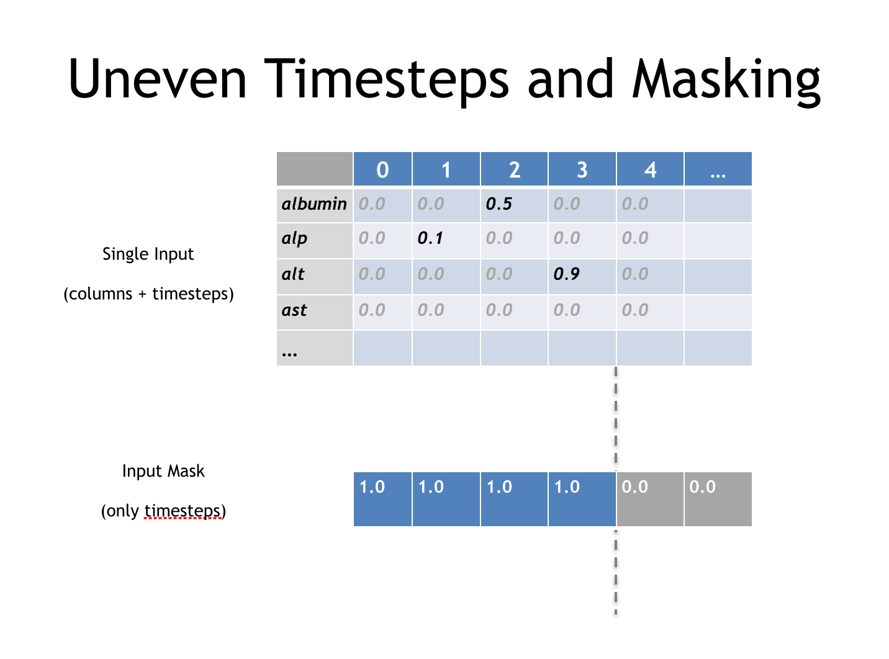

# Introduction to Recurrent Neural Networks 

# Table of Contents

* Overview
* Distributed hidden State 
* How RNN’s train 
* LSTM tuning
* Time Series and RNN’s

-------------------

* **&rArr;** Overview
* Distributed hidden State 
* How RNN’s train 
* LSTM tuning
* Time Series and RNN’s

-------------------

# What is a Recurrent Neural Network?

* FeedForward Network with hidden state
* Hidden state with own internal dynamics
* Information can be stored in "hidden state" for a long time

***In this section when we refer to RNN we mean Graves LSTM as defined here cite paper***

-------------------

# Recurrent Neural Networks and Sequence Data

* Recurrent Neural Networks have the capacity to recognize dependencies in time series data
* Breaking a text corpus into a series of single characters allows the network to learn dependencies such as the most common letter after a "Q" is a "U", when a quote has been opened it should eventually be closed.
* In the Lab you will train a neural network to write weather forecasts.

-------------------

# The Challenge of Deep FeedForward Networks

* Vanishing or Exploding Gradients with backprop training

-------------------

# Another Challenge

It should be noted that while feedforward networks map one input to one output, recurrent nets can map one to many, as above (one image to many words in a caption), many to many (translation), or many to one (classifying a voice).

-------------------

* Overview
* **&rArr;** Distributed hidden State 
* How RNN’s train 
* LSTM tuning
* Time Series and RNN’s

-------------------

# How an LSTM RNN works

* LSTMs contain information outside the normal flow of the recurrent network

* Network learns to store data there, read data from there, replace data in there

-------------------

# How the gates function

they block or pass on information based on its strength and import, which they filter with their own sets of weights. 

-------------------

# How the gates learn

the cells learn when to allow data to enter, leave or be deleted through the iterative process of making guesses, backpropagating error, and adjusting weights via gradient descent

-------------------

# Going Deeper (perhaps too much info here)

Different sets of weights filter the input for input, output and forgetting. The forget gate is represented as a linear identity function, because if the gate is open, the current state of the memory cell is simply multiplied by one, to propagate forward one more time step.

-------------------

# Why remember ?

Think of text as a series of characters. Things to remember, a quote has been opened, a paranthesis has been opened. 

-------------------

# Why Forget ?

Once a quote has been closed forget about it

-------------------

# A better example

Credit card activity

USA,USA,USA,Ireland,Ireland,Ireland,Russia,Ireland,Ireland,Russia

VS

USA,USA,USA,Ireland,Ireland,Ireland,Ireland,Ireland,Russia,Russia

Stateful observance of noting assumed arrival and departure from location

-------------------

# Benefit of RNN

* Instead of pre-configured window of time steps
* Flexible state information for flexible length events

-------------------

# Benefits of RNN's

* Distributed Hidden State
* Several different units can be active at the same time
* Can remember several different things
* Non-linear can update hidden state in complicated ways
* Hinton quote
"With enough neurons and enough time, a recurring neuron network can compute anything that can be computed by your computer." coursera course

-------------------

# More Benefits What can RNN's model, what behavior can they exhibit

* Oscillations, motor control, walking robot
* Settle to point attractors 

-------------------

# Challenges of RNN's

* Complexity makes them hard to train

-------------------

* Overview
* Distributed hidden State 
* **&rArr;** How RNN’s train 
* LSTM tuning
* Time Series and RNN’s
-------------------

# Training

* Back Propogation Through time
* think of it as feed forward network with constrained weights. 

Think of RNN as discrete time steps and (see Hinton Coursera)

-------------------

# Training Goal, one sequence to another Sequence

* When modeling Sequential data we often want to turn one sequence into another sequence

* A phrase in english to a phrase in Spanish

* Sequence of audio ad convert into word identitites

-------------------

# Training Goal

* Next timestep of current sequence

---------

# Non Sequence data as Sequence data

* Pixels in an image , or Grid of pixels applied to next Grid
* works quite well, feels less natural

---------

# Four ways to train an RNN

* LSTM 
 Make the RNN out of little modules that are designed to remember values for a long time. 
 
 * Use Better Optimizer HEssian Free
 
 That can deal with very small gradients. 
 (Martens & Sutskever 2011)
 
 * Echo State Networks
 
 This sound cool, oscilators that reverberate for a while. 

Not sure if this makes sense for this course

---------

# LSTM in depth

Consider the current state as short term memory, then we want to find a way to make this long term

Add modules that allow information to be gated in, and information to be gated out when needed. 

In between information being gated in and gated out the gate is closed allowing it to remember the gated state. 

->Gate open->Information stored -> Gate open information forgot->

Repeat. 

---------

# LSTM in depth

* Very succesful recognizing handwriting

---------

# LSTM in depth

* Information gets into the cell whenever a logistic write gate is on

The rest of the recurrent network determines the state of that write gate, and when the rest of the recurrent network wants information to be stored, it turns the write gate on, and whatever the current input from the rest of the net to the memory cell is, gets stored in the memory cell.

-plagiarized Hinton-

The information stays in the memory cell so long as its keep gate is on. So again, the rest of the system is determining the state of a logistic keep gate, and if it keeps it on, then the information will stay there.

And finally, the information gets read from the memory cell so that it then goes off to the rest of the recurrent neural network and influences future states and it's read by turning on a read gate, Which again is a logistic unit controlled by the rest of the neural network. 

The memory cell actually stores an analog value, so we can think of it as a linear neuron that has an analog value and keeps writing that value to itself at each time step by a weight of one, so the information just stays there.

Grab and create a version of his discussion about keep gates, Lecture 7 Final video. 

---------

# Cursive handwriting recogntion

Input is squence of pen coordinates as text is written

Output is sequence of characters

Graves & Schmidhuber (2009)

If timing of pen is not known, the sequence of small images as input works

---------

# For Character Recognition

Ask what the net knows...
words? Yes
Days ? 

brackets, quotes, etc

See Lecture 8 3 Hinton

---------

# RNN's require much less training data than others on NLP stuff. 

---------

* Overview
* Distributed hidden State 
* How RNN’s train 
* **&rArr;** LSTM tuning
* Time Series and RNN’s

---------

# LSTM Hyperparameter Tuning

* Watch out for overfitting, which happens when a neural network essentially “memorizes” the training data. Overfitting means you get great performance on training data, but the network’s model is useless for out-of-sample prediction.

* Regularization helps: regularization methods include l1, l2, and dropout among others.

* The larger the network, the more powerful, but it’s also easier to overfit. Don’t want to try to learn a million parameters from 10,000 examples – parameters > examples = trouble.
* More data is almost always better, because it helps fight overfitting.
* Train over multiple epochs (complete passes through the dataset).
* Evaluate test set performance at each epoch to know when to stop (early stopping).
* The learning rate is the single most important hyperparameter. Tune this using deeplearning4j-ui; see this graph
* In general, stacking layers can help.
* For LSTMs, use the softsign (not softmax) activation function over tanh (it’s faster and less prone to saturation (~0 gradients)).
* Updaters: RMSProp, AdaGrad or momentum (Nesterovs) are usually good choices. AdaGrad also decays the learning rate, which can help sometimes.
* Finally, remember data normalization, MSE loss function + identity activation function for regression, Xavier weight initialization

---------

# Recurrent neural networks

# MOVE THIS UP

* Family of feedforward networks
	* Differ in how they send information over timesteps
* Allows for modeling change in vectors over time
	* Multiple sets of vectors as inputs
	* As opposed to a single input feature vector

-------------------

* Overview
* Distributed hidden State 
* Previous tools for Speech Recognition
* How RNN’s train 
* LSTM tuning
* **&rArr;** Time Series and RNN’s

-------------------

# Timeseries and Recurrent Networks

* When dealing with sequential or timeseries data
	* We prefer to apply Recurrent Networks
* Allows us to plug in how the data changes over time
	* Patient data collected periodically
	* State of power grid over time
	* Sequence of actions by customer

-------------------

# RNN Architectures

Add Captions somehow, or rebuild image

* Standard supervised learning
* Image Captioning
* Sentiment Analysis
* Video Captioning, Natural Language Translation
* Part of Speech Tagging
* Generative Mode for text

-------------------

# Example: PhysioNet Raw Data

* Set-a
	* Directory of single files
	* One file per patient
	* 48 hours of ICU data
* Format
	* Header Line
	* 6 Descriptor Values at 00:00 
	* Collected at Admission 
	* 37 Irregularly sampled columns
	* Over 48 hours

-------------------

# Physionet Data

Time,Parameter,Value
00:00,RecordID,132601
00:00,Age,74
00:00,Gender,1
00:00,Height,177.8
00:00,ICUType,2
00:00,Weight,75.9
00:15,pH,7.39
00:15,PaCO2,39
00:15,PaO2,137
00:56,pH,7.39
00:56,PaCO2,37
00:56,PaO2,222
01:26,Urine,250
01:26,Urine,635
01:31,DiasABP,70
01:31,FiO2,1
01:31,HR,103
01:31,MAP,94
01:31,MechVent,1
01:31,SysABP,154
01:34,HCT,24.9
01:34,Platelets,115
01:34,WBC,16.4
01:41,DiasABP,52
01:41,HR,102
01:41,MAP,65
01:41,SysABP,95
01:56,DiasABP,64
01:56,GCS,3
01:56,HR,104
01:56,MAP,85
01:56,SysABP,132
…

-------------------

# Preparing Input Data

* Input was 3D Tensor (3d Matrix)
	* Mini-batch as first dimension
	* Feature Columns as second dimension
	* Timesteps as third dimension
* PhysioNet: Mini-batch size of 20, 43 columns, and 202 Timesteps
	* We have 173,720 values per Tensor input

TH- explain batch and minibatch in terms of training

-------------------

# Input Sequence

* A single training example gets the added dimension of timesteps per column

-------------------

-------------------

# Recurrent Networks For Classification

* This is the “many-to-one” setup
	* Traditionally we’d do hand coded feature extraction on timeseries and encode into a vector
		* Losing the time aspect to the data
	* The “many”-part allows us to input a sequence without losing the time domain aspect
* Input is a series of measurements aligned by timestep
	* 0,1,0,0
	* 1,0,1,1
* Output in this case is a classification
	* Example: “Fraud vs Normal transaction”

-------------------

# Sequence Classification with RNNs

* Recurrent Neural Networks have the ability to <i>model change of input over time</i>
* Older techniques (mostly) do not retain time domain
	* Hidden Markov Models do…
		* <i>but are more limited</i>
* Key Takeaway: 
	* For working with Timeseries data, RNNs will be more accurate

-------------------

