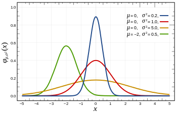
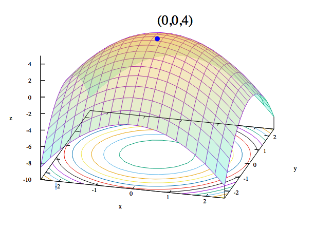

# Introduction to Machine Learning

-------------------

# Introduction to Machine Learning

* Topics Covered

This section covers the big picture of Machine Learning and how deep learning fits in. 

1. Machine Learning
2. Data Science / Data Mining
3. Deep Learning

-----------

# Machine Learning

-----------

# What is Machine Learning?

* Extracting Knowledge from raw data in the form of a model
	* Decision trees
	* Linear Models
	* Neural Networks

* Arthur Samuel quote
  * "Field of study that gives computers the ability to learn without being explicitly programmed"

-------------------

# A Diagram

---------

# Data Science / Data Mining

---------

# Machine Learning Compared to Data Science/Mining
* Data Mining
    * The process of extracting information from the data
    * Uses Machine Learning
* Data Science
	* Data Mining from the lens of a statistician
	* Venn Diagrams
	* A way to get a raise
	* A more agreeable Actuary
	* A statistician using a Mac

----------

# Deep Learning

* Deep learning (also known as deep structured learning, hierarchical learning or deep machine learning) is a branch of machine learning based on a set of algorithms that attempt to model high level abstractions in data.

source - wikipedia

----------

# Neural Networks

* A computational approach patterned on the human brain and nervous system

----------

# Biological Neurons

* Biological Neuron: An electrically excitable cell that processes and transmits information through electrical and chemical signals
* Biological Neural Network: An interconnected group of Neurons

----------

# Role of Artificial Neural Network

* Learns or Trains to perform tasks that traditional programming methods find rather challenging. Speech recognition, object recognition, computer vision, pattern recognition.

----------

# A Neural Network

--------------

# Using Neural Networks

## Framing the Questions

* To build models we have to define
	* What is our training data (“evidence”)?
	* What kind of model (“hypothesis”) is appropriate for this data?
	* What kind of answer (“inference”) would we like to get from the model?
* These questions frame all machine learning workflows

----------

#  In neural networks we’re solving systems of (non-linear) equations of the form

# Ax = b

* A matrix
	* This is our set of input data converted into an array of vectors
* x vector
	* The parameter vector of weights representing our model
* b vector
	* Vector of output values or labels matching the rows  in the A matrix

----------

#Ax = b Visually

----------

# Demo: Simplest Network

* Your Instructor will demonstrate a simple Neural Network

----------

#Linear Algebra Terms

* Scalars
	- Elements in a vector
	- In compsci synonymous with the term “variable”
* Vectors
	* For a positive integer n, a vector is an n-tuple, ordered (multi)set, or array of n numbers, called elements or scalars
* Matricies
	* Group of vectors that have the same dimension (number of columns)

----------

#Solving Systems of Equations
* Two general Methods
	* Direct method
	* Iterative methods
* Direct method
	* Fixed set of computation gives answer
	* Data fits in memory
	* Ex: Gaussian Elimination, Normal Equations
* Iterative methods
	* Converges after a series of steps
    * Stochastic Gradient Descent (SGD)

----------

# Vectorization
* To solve Ax = b  with optimization methods such as SGD
	* We have to get raw data into the vectors and matrices
* This ends up being a lot of work
	* most folks never consider this phase to be *sniff* “real machine learning”
* Actually it's pretty key to building good models

----------

# Vectorization Tools

* DataVec provides tools for ingestion raw data and converting to Vectors and Matrices
  * CSV data
  * Image data
  * Sequence data
  * and more...

----------

# Quick Statistics Review: Probability
* Probability
	* We define probability of an event E as a number always between 0 and 1. 
	* In this context the value 0 infers that the event E has no chance of occurring and the value 1 means that the event E is certain to occur. 
* The Canonical Coin Example
	* Fair coin flipped, looking for heads/tails (0.5 for each side)
	* Probability of sample space is always 1.0
	* P( Heads ) = 0.5 every time

----------

# Probability Distributions
* A specification of the stochastic structure of random variables
* In statistics we rely on making assumptions about how the data is distributed
	* To make inferences about the data
* We want a formula specifying how frequent values of observations in the distribution are
	* And how values can be taken by the points in the distribution

----------

# High-Level Machine Learning

* Determine
	* Output desired (“question to be answered”)
	* Input data to build model (“evidence”)
	* Appropriate model (“hypothesis”)
* Setup data in Ax = b form
	* For linear models and neural networks
* Then Optimize the x parameter vector

----------

# Fitting the Training Data

----------

# Optimization
* Iteratively adjust the values of the x parameter vector
	* Until we minimize the error in the model
* Error = prediction – actual
* Loss functions measure error
	* simple/common loss function: 
	* “mean squared error”
* How do we make choices about the next iterative “step”?
  * Where  “step” is how we change the x parameter vector

----------

# Convex Optimization

----------

#Gradient Descent
* Optimization method where we consider parameter space as
	* “hills of error”
	* Bottom of the loss curve is the most “accurate” spot for our parameter vector
* We start at one point on the curved error surface
	* Then compute a next step based on local information
* Typically we want to search in a downhill direction
	* So we compute the gradient
		* The derivative of the point in error-space
		* Gives us the slope of the curve

----------

# Stochastic Gradient Descent
* With basic Gradient Descent we look at every training instance before computing a “next step”
* With SGD with compute a next step after every training instance
	* Sometimes we’ll do a mini-batch of instances

TH-clean this up

----------

# SGD Visually Explained

----------

# Underfitting and Overfitting
* Underfitting
	* Our model does not learn the structure of the training data well enough
	* Doesn’t perform on new data as well as it could
* Overfitting
  * Our model gives tremendous accuracy scores on training data
  * However, our model performs poorly on test data and other new data

----------

# Supervised vs Unsupervised Learning

* Supervised Learning
  * We give the training process labels (“outputs”) for every training input data row
  * Model learns to associate input data with output value
* Unsupervised Learning
  * No labels
  * Model attempts to learn structure in the data
* Neural Networks can be used for either supervised or unserpervised Learning

----------

# NEED STRUCTURE PAGE HERE, SOMETHING LIKE

# FRAMING THE QUESTION
* Classification
* Regression
* Clustering
.....

----------

# Classification

* A type of answer we can get from a model
* Example:
	* “Is this an image of a cat or a dog?”
	* Binary classification
	* Classes: { cat, dog }
* Binary classification is where we have only 2 labels
	* Example: { positive, negative }
* Multi-Label Classification
	* N number of labels

----------

# Regression
* Where we seek a continuous value output from the model
* Example: “predict the temperature for tomorrow”
	* Output: 75F
* Example: “predict price of house based on square footage”
	* Output: $250,000.00

----------

# Clustering
* Typically unsupervised learning
	* “K-Means Clustering”
* Example
	* “cluster K groups of similar news articles together”

----------

# Logistic Regression
* 3 parts to Logistic Regression Model
	* Hypothesis (logistic function): 
		* Gives us a prediction based on the parameter vector x and the input data features
	* Cost Function
		* Example: “max likelihood estimation”
		* Tells us how far off the prediction from the hypothesis is from the actual value
	* Update Function
		* Derivative of the cost function
		* Tells us what direction / how much of step to take
[ more notes, gradient, etc ]
----------

# Evaluation and The Confusion Matrix
* Table representing
	* Predictions vs Actual Data
* We count these answers to get
	* True Positives
	*  False Positives
	* True Negatives
	* False Negatives
* Allows us to evaluate the model beyond “average accurate” percent
	* Can look at well a model can perform when it needs to be more than just “accurate a lot” 

----------

# Chapter Questions

* Is all DeepLearning Machine Learning? 
* Is all Machine Learning Deep Learning? 
* Need more? Probably need to structure the chapter a little bit so it answers specific questions

