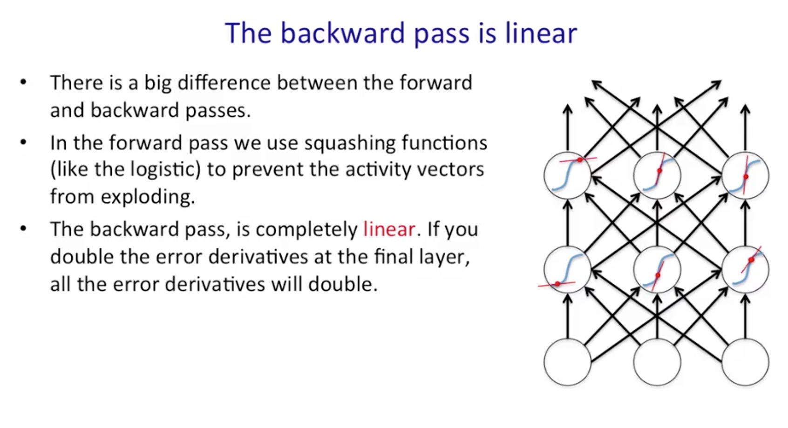

# Modeling Sequences

* Overview
* Challenges of Training Deep Networks
* Recurrent Neural Networks

-------------------

* **&rArr;** Overview
* Challenges of Training Deep Networks
* Recurrent Neural Networks

-------------------

# Tasks when modeling Sequences

* Input Sequence to Output Sequence
  * French to Spanish
  * Speech Recognition
	* Sound Pressures to word identities
* Training Sequence try to predict the value for current step + 1

--------------

# Sequence thinking outside the box

* Sequence of words make sense conceptually
* Sequence of network requests fit pattern as well
* Sequence of Pixels in image??

--------------

# Supervised vs unsupervised

* Training to predict Next term in Sequence blurs that line between supervised and unsupervised

--------------

* Overview
* **&rArr;** Challenges of Training Deep Networks
* Recurrent Neural Networks

--------------

# Vanishing Gradient

* Stolen from Hinton, breakdown and adapt

--------------

# Vanishing Gradient

* Backpropagation through many layers increases likelihood of vanishing or exploding gradients
* Challenge to get training signal to early layers
* Linear process
* If weights are small gradient shrinks
* If weights are large the gradient explodes
* Solution is LSTM to preserve time based info isolated from backprop

<!--

And so, when you back propagate, you're using the gradients of the blue curves at those red dots. So the red lines are meant to throw the tangents to the blue curves at the red dots. And, once you finish the forward pass, the slope of that tangent is fixed. You now back propagate and the back propagation is like going forwards though a linear system in which the slope of the non-linearity has been fixed. Of course, each time you back propagate, the slopes will be different because they were determined by the forward pass. But during the back propagation, it's a linear system and so it suffers from a problem of linear systems, which is when you iterate, they tend to either explode or die. So when we backpropagate through many layers if the weights are small the gradients will shrink and become exponentially small. And that means that when you backpropagate through time gradients that are many steps earlier than the targets arrive will be tiny. Similarly, if the weights are big, the gradients will explode. And that means when you back propagate through time, the gradients will get huge and wipe out all your knowledge. 

 The first is a method called long short term memory and I'll talk about that more in this lecture. The idea is we actually change the architecture of the neural network to make it good at remembering things. 
5:45
The second method is to use a much better optimizer that can deal with very small gradients. I'll talk about that in the next lecture. The real problem in optimization is to detect small gradients that have an even smaller curvature. Heissan-free 

-->

--------------

* Overview
* Challenges of Training Deep Networks
* **&rArr;** Recurrent Neural Networks

--------------

# RNN's power

* Distributed Hidden State
* Multiple hidden units can be active at once
  * Can "remember" several different things
* Nonlinear
  * Allows updates to hidden state in complicated ways
* With enough neurons and enough time theycan compute anything that can be computed on your computer (Hinton Coursera course)  

--------------

# What can an RNN model

* Oscillation
  * motor control, walking robots
  
--------------

# Back Propagation through time

* Advanced topic
* The recurrent net is conceptually a layered net that re-uses the same weights
* Layered feed forward network with weights constrained at each layer to be the same

--------------

# Back Propagation through time

* Compute the gradients as usual
* Modify to meet the constraint (time constraint previous slide)
* Represent RNN as feed forward net with shared weights
* Forward pass builds stack of activities at each time slice
* Backward pass peels activities off that stack and computes error derivatives
  * That is why called BackProp through time.
* After back prop for each time step constrain weights to match  

<!-- 
The backpropagation through time algorithm is just the name for what happens when you think of a recurrent net as a lead feet forward net with shared weights, and you train it with backpropagation.(hinton)
-->

<!--
The forward pass builds up a stack of activities at each time slice. And the backward pass peels activities off that stack and computes error derivatives each time step backwards. That's why it's called back propagation through time. After the backward pass we can add together the derivatives at all the different time step for each particular weight. And then change all the copies of that weight by the same amount which is proportional to the sum or average of all those derivatives.(hinton)
-->

--------------

