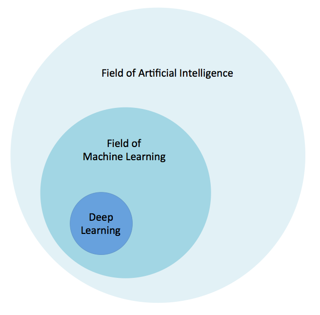

# The Building Blocks of Deep Learning

-----------------

# Gradient Descent

* Tom has some pictures 

-------------------

# Back Propagation

Have picture may need updated

-------------------

# Nonlinearities

* Tom has nothing here
* Bullets provide by Dave..
* Dave was here
  * More from Dave 

-------------------

# Dropout

* Bullets provide by Dave..
* Dave was here
  * More from Dave 

-------------------

<!-- 

---------

-->
